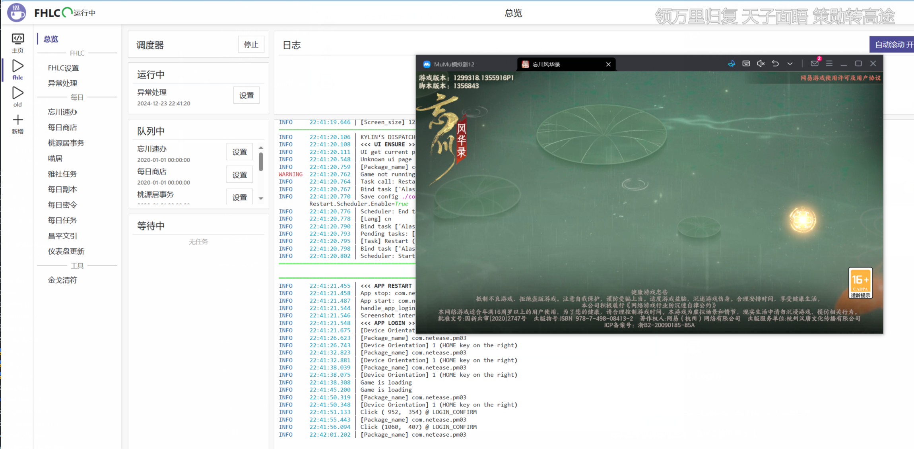

# FHLCopilot(还在施工中)

忘川风华录 自动化日常脚本

基于[SRC](https://github.com/LmeSzinc/StarRailCopilot/)/ [AzurLaneAutoScript](https://github.com/LmeSzinc/AzurLaneAutoScript)框架开发

## 1.最近画的饼

仪表盘更新，购买打本功能加上道具数量检测

昌平文引领奖励和经验，加个OCR识别每日每周任务，但是不打算做任务

给密令脚本加个微信安装路径选项，好像读注册表换台设备就崩

每日雅社悬赏领取，周奖励领取

雅社活动识别

商店自定义购买，支持购买每周道具

自动躲猫猫（抓猫猫和凑天命对

## 2.开发需求记录

### 2.1 每日登录 tasks\Login

~~签到/占卜~~

~~处理各种广告（周三更新、卡池更新、新主线、金戈至尊结英~~

**活动签到/福利忘川签到** ←偶尔会抽风 等优化

### 2.2 商店领礼包 tasks\Shop

目前每天自动买铜币喵偶、喵居小玩具和碎片，签到礼包和领月卡 

图标命名：一级菜单\_二级菜单\_GOODS_物品名

TODO:每日每周一起买，设定个优先级 每日> 每周，道具不够了就优先买每日

部分翻译：

PICK 精选

普通喵偶 >>> 混沌灵元（CHAOS SPIRIT） > 莹明石（LIGHT STONE) > 琼霓染料 （DYE)

FRIENDSHIP 友情

羁绊宝匣（FRIENDSHIP_GIFT)（100） >>> 普通喵偶（3x100） > 莹明石 （ 5x100）> 天品信物宝匣（500）

-CATTERY 喵居

猫玩具礼包 > 名士信物 >>> 喵球 > 小东西 > 3只猫

### 2.3 桃源居 tasks\Office

#### 配置：

用通宝购买错过午晚饭体力（）

考工治图道具转换（）

是否拜访他人领君子兰（）

* ~~首次登陆领祝福~~

* 领体力（中午11-15点 领第一个体力 下午17-22 领第二个体

  **错过的体力没写怎么领**

* ~~百工图转换~~

* ~~做事件~~

  **领印象奖励没写**

* ~~拜访~~

  我的拜访列表里给前三个送花，

  #TODO: **没测列表里不够三个时怎么办**

* ~~打随机家具~~

### 2.4 喵居 tasks\Cattery

- ~~可能有冒出来的领猫界面背刺~~

  有的时候可能会出现让捏脸的猫，直接默认了。。。

- ~~每日吸猫  DAILY_PLAY_WITH_CAT~~

- ~~幸福值喂食领奖 DAILY_FEED_CAT~~

### 2.5 小麒麟头(忘川速办) tasks\Dispatch

* ~~领取是红色的话领供台、虾球~~

  ALTAR 供台  SHRIMP_BALL虾球

* ~~名士赠礼 task\Dispatch\interact~~

  **#TODO: 好感不到10级的时候送满/20级以后怎么处理**

（暂时放这的
* ~~知交圈点赞三次 task\Dispatch\moments~~
* ~~世界频道发送两次表情 task\Dispatch\channel~~

（还没写的
* 躲猫猫 HIDE_AND_SEEK

  先领助手奖励

  屏幕上有加号就点一下看看有没有多余猫，有的话放上去

  然后就是寻猫，这个按指令库点选项？

  真写到这了去私信蓝佬问能不能要文字版的指令

  安排天命（6

  天命奖励有红点就点？

### 2.6 雅社 tasks\Guild

* ~~检测有没有雅社~~

* ~~签到~~

* ~~放河灯~~

* **悬赏**

  做前三个任务

  任务列表（还没收集全）：

  剑荡风云：与xxx在故世风云困难战斗胜利3次

  故世探秘：故世风云困难战斗胜利2次
  
  镜渊破幻：击退5个镜之心魔

  镜中镇幻：与任意一位至契名士在镜渊战斗胜利3次

  宝墟除恶：击退4只蚌精

  宝墟求珍：与xxx在宝墟战斗胜利3次

  结社共济：完成1次雅社签到

  聊表寸心：提升1000点xxx与使君的羁绊值

  大功告成：每日必做活跃度达到100

  商铺交易：消耗100贡献

  河灯许愿： 完成1次雅社信物许愿

* 其他还没截过图的

  抽卡1次（优先用普通抽。。。

  给xxx朋友圈点赞

  桃源居合影

  =============

  击退5个镜之心魔 = 2镜渊

  击退4只蚌精=2宝墟

  与xxx在宝墟战斗胜利3次

  回来领赏

### 2.7 金戈清符 PVP\JinGeYanWu

~~能跑但还有点毛病~~

**配置：**

~~已购买九段商店解锁道具（每周重置）~~

~~九段后自动暂停去商店买猫然后继续打~~

**有空优化一下怎么等待加减星星和符飞进盒子里的动画之后再点击，不然总要等**

七段以上，11-14和19-21时间以外打人机可以领每日奖励
但是不算活跃度和bp任务

### 2.8 沙盘清旗 PVP\ShaPanLunYi

~~差不多了~~

### 2.9 每日副本 Dungeon

在Combat写了编队打镜渊宝墟，固定队伍5，写完发现src有

编队：

1.镜渊 宝墟

2.故世 金戈 而且会记录上次的队伍 上次是三就是三

1. 时之涯（单独的一个
2. 幽墟 单独的

### 2.10 昌平文引（BattlePass）

TODO:每天去领一下经验和奖励

#### 每日

**已经写完的：**

~~知交圈点赞3次~~

~~世界频道发言2次~~

~~快乐吸猫1次~~

~~发送友情点10次~~

**不打算写的：**

提升2级灵器等级

灵器重蕴5次

提升单个名士等级1级

累计消耗铜币20万

结喵亲

消耗300体

培育喵5次

#### 每周：

累计消耗体力1500点

日志活跃度累计达400点

灵器重蕴50次

结算一次乾坤玄局积分

完成2次更金换物

累计消耗铜币100万

进行寻英10次

=========计算器======

每日 保底120\*28=3360
每周 500\*4保底 
1500体看人
活跃度那个最后一周达不到 算300

每期任务

抽5天卡 1000

登录25天 1250 

五条忘川风华 1250

金戈胜利50次 1250 

好吧这些全加上了也才50级左右。。。。拿满要么得手打要么去写每天找个人升级和养猫猫

### 2.11 每日活跃领奖 DAILY_QUEST

目前做完一套是65活跃度 好友不够五个的话会少到55

休闲：

快乐吸猫 10

猫咪心意 5

桃园事务 10

结社共济 10（雅社签到？

结赠欢友 10（给5次友情点

寻喵之游 10 （自动领一次躲猫猫

勤修

名士赠礼 5

家具制作 5

灵器强化 5

名士强化 5

75了

3次金戈 30

1次镜渊 10

4次宝墟 40

3次故世风云 30

### 2.12 每日密令 tasks\Daily\getpsw&fillpsw

大概是写完了，先跑几天试试看

用pywinauto登录微信签到然后摘取消息里的口令（会抢鼠标）

再进模拟器填写，会把每周密令同步到config

**已知Bug:**

微信在后台的时候打不开微信

有时候在推文里放密令，现在筛不出来

模拟器窗口置顶，覆盖住微信窗口之后可能会发生pywinauto找到控件然后点到模拟器的情况

## 安装

#TODO:

